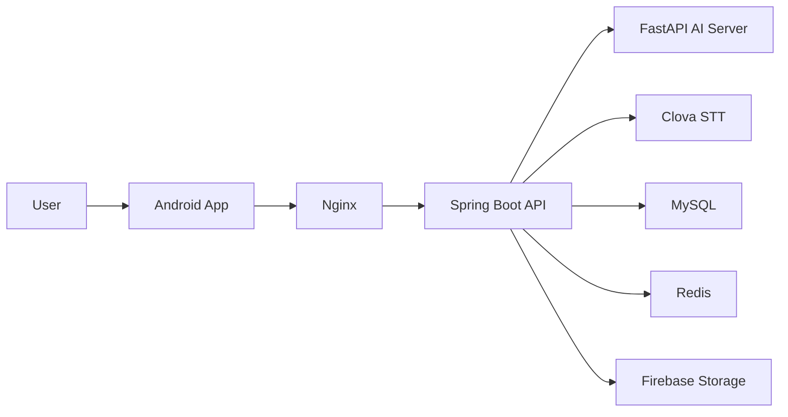

# LUNO

> 통화 음성, 문자 URL, 신고 이력을 결합해 보이스피싱 위험을 빠르게 판단하는 모바일 보안 서비스

[Google Paly 바로가기](https://play.google.com/store/apps/details?id=com.luno.lunofrontend)

## 🎬 Demo

## Overview
LUNO는 통화 중 녹음 음성을 분석해 보이스피싱 위험도를 점수와 등급으로 제공하고,
문자에 포함된 URL 위험 여부를 함께 확인할 수 있는 Android 기반 서비스입니다.

핵심은 모바일 앱, 백엔드 API, AI 추론 서버를 분리해
분석 파이프라인을 안정적으로 운영할 수 있도록 구성한 점입니다.

## ScreenShots
<table>
  <tr align="center">
    <td><b>메인 화면</b></td>
    <td><b>문자 분석</b></td>
    <td><b>분석 결과</b></td>
  </tr>
  <tr>
    <td></td>
    <td></td>
    <td></td>
  </tr>

  <tr align="center">
    <td><b>번호 입력</b></td>
    <td><b>분석 중</b></td>
    <td><b>위험도 결과</b></td>
    <td></td>
  </tr>
  <tr>
    <td></td>
    <td></td>
    <td></td>
    <td></td>
  </tr>
</table>

## Key Features
- 통화 음성 업로드 후 STT + AI 위험도 분석
- 위험 점수/등급/유형/요약 결과 제공
- 문자 URL 위험 여부 즉시 조회
- 개인 통화 이력 조회
- 스캠 보드(사기 사례/이력) 조회

## Tech Stack
| Layer | Stack |
|---|---|
| Mobile | Kotlin, Jetpack Compose, Retrofit2, OkHttp |
| Backend | Java 17, Spring Boot, Spring Security(JWT), Spring Data JPA |
| AI | Python, FastAPI |
| Data/External | MySQL, Redis, Firebase Storage, Clova STT, Google OAuth |
| Infra/Deploy | AWS, Nginx |

## System Architecture

## System Diagram

## Deployment
LUNO는 Docker 없이 AWS + Nginx 기반으로 배포했습니다.

### 1) 트래픽 진입점
- 클라이언트는 `https://soowan.cloud` 도메인으로 요청합니다.
- Nginx가 퍼블릭 엔드포인트를 담당하고, 외부 요청을 내부 애플리케이션으로 전달합니다.

### 2) Nginx 리버스 프록시 구성
- Nginx는 리버스 프록시로 동작하며 애플리케이션 서버를 직접 외부에 노출하지 않도록 구성했습니다.
- 백엔드(Spring Boot)는 내부 포트(`8080`)에서 실행되고, Nginx를 통해서만 접근됩니다.
- AI 서버는 백엔드에서 `AI_SERVER_BASE_URL`로 호출하는 내부 서비스로 분리했습니다.

### 3) 애플리케이션 분리 운영
- Spring Boot API와 FastAPI AI 서버를 역할별로 분리해 배포했습니다.
- 분석 요청은 백엔드가 오케스트레이션하며, AI 서버는 추론 처리에 집중합니다.
- 이 구조로 API 안정성과 모델/추론 로직의 독립적인 변경이 가능하도록 했습니다.

### 4) 데이터 및 외부 연동
- MySQL: 사용자/분석/이력 데이터 영속 저장
- Redis: 캐시 및 조회 성능 보조
- Firebase Storage: 업로드 오디오 파일 저장
- Clova STT: 음성 텍스트 변환

### 5) 운영 포인트
- Android 앱의 API Base URL을 도메인 기준으로 고정해 배포 환경 전환 시 클라이언트 변경 범위를 줄였습니다.
- 인증(JWT), 캐시(Redis), 영속화(MySQL), 파일 저장(Firebase)을 분리해 운영 안정성을 확보했습니다.
