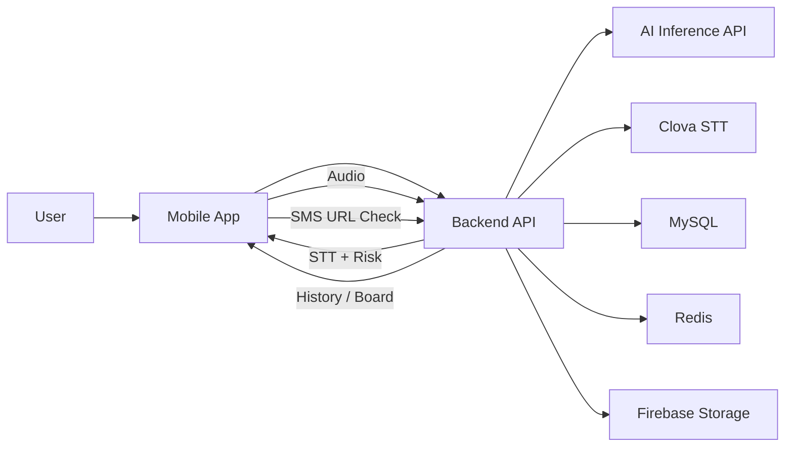

# LUNO

> 통화 음성·문자 URL·신고 이력을 결합해 보이스피싱 위험을 빠르게 판단하는 모바일 보안 서비스

## 한 줄 요약
LUNO는 STT, AI 추론, URL 검증, 이력 관리를 통합해 통화 중 보이스피싱 위험을 빠르게 경고합니다.

## 문제 정의
보이스피싱은 통화 중 즉시 판단이 어렵고, 사후 대응만으로 피해를 줄이기 어렵습니다.  
번호·키워드·URL 단일 신호 기반 탐지는 오탐/미탐이 잦습니다.  
LUNO는 다중 신호를 하나의 파이프라인으로 묶어 즉시 대응 가능한 경고를 제공합니다.

## 시스템 아키텍처 핵심 구조
- **Mobile App**: 로그인, 권한, 분석 요청/조회
- **Backend API**: 인증, 도메인 로직, 외부 연동 오케스트레이션
- **AI Inference API**: 위험도 추론 독립 운영
- **Data Layer**: MySQL(영속), Redis(캐시), Firebase Storage(오디오)

설계 철학: 모델 실험 주기와 서비스 운영 주기를 분리해 안정성과 확장성을 확보합니다.

## 시스템 다이어그램


## 핵심 기능
1. 통화 분석 파이프라인(업로드 -> STT -> AI 추론 -> 저장)
2. 위험 점수·등급·유형·요약 제공
3. 문자 URL 즉시 검증
4. 개인 이력 조회와 스캠 보드 제공

## 기술 스택
- **Mobile**: Kotlin, Jetpack Compose, Retrofit2, OkHttp
- **Backend**: Java 17, Spring Boot, Spring Security(JWT), Spring Data JPA
- **AI**: Python, FastAPI, PyTorch, Transformers
- **Infra/Data**: MySQL, Redis, Firebase Storage, Clova STT, Google OAuth

## Quick Start
### 필수 요구사항
Git 2.40+, Java 17, Python 3.10+, Android Studio, MySQL 8+, Redis 7+

### 프로젝트 클론
```bash
git clone <YOUR_GITHUB_REPO_URL>
cd <YOUR_REPO_DIR>
```

### 환경 변수
- Backend: `DB_URL`, `DB_USERNAME`, `DB_PASSWORD`, `GOOGLE_CLIENT_ID`, `jwt.secret`, `CLOVA_*`, `AI_SERVER_BASE_URL`
- AI: `HOST=0.0.0.0`, `PORT=8000`, `MODEL_DEVICE=cpu`
- 추가 파일: `backend-deploy/firebase-key.json`

### 외부 의존성 실행
```bash
docker run -d --name luno-mysql -e MYSQL_ROOT_PASSWORD=root -e MYSQL_DATABASE=luno -p 3306:3306 mysql:8.0
docker run -d --name luno-redis -p 6379:6379 redis:7
```

### 실행
```bash
# AI
cd AI-main
python3 -m venv .venv && source .venv/bin/activate
pip install -U pip -r requirements.txt
uvicorn app.main:app --host 0.0.0.0 --port 8000 --reload

# Backend
cd ../backend-deploy
cp .env.template .env
./gradlew bootRun

# Frontend
cd ../frontend-develop
./gradlew assembleDebug
```

실행 순서: MySQL/Redis -> DB 스키마 -> AI -> Backend -> Frontend

## 향후 개선
- 스트리밍 STT/추론으로 경고 시점 단축
- 한국어 도메인 데이터 확장으로 정확도 개선
- 로그·메트릭·트레이싱 기반 운영 관측성 강화
